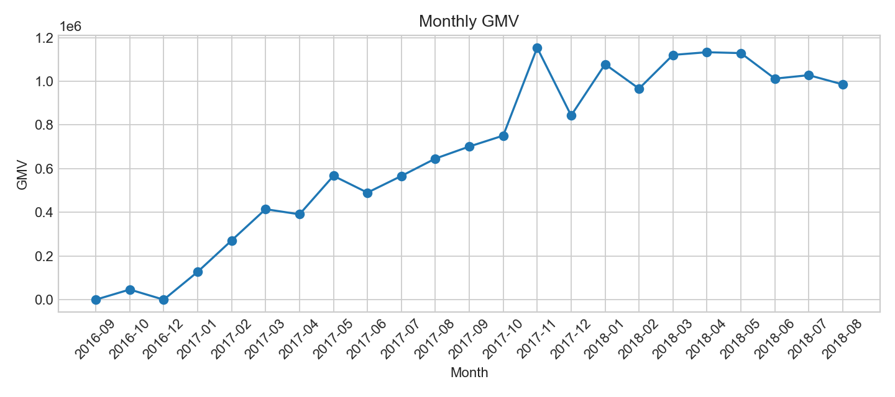
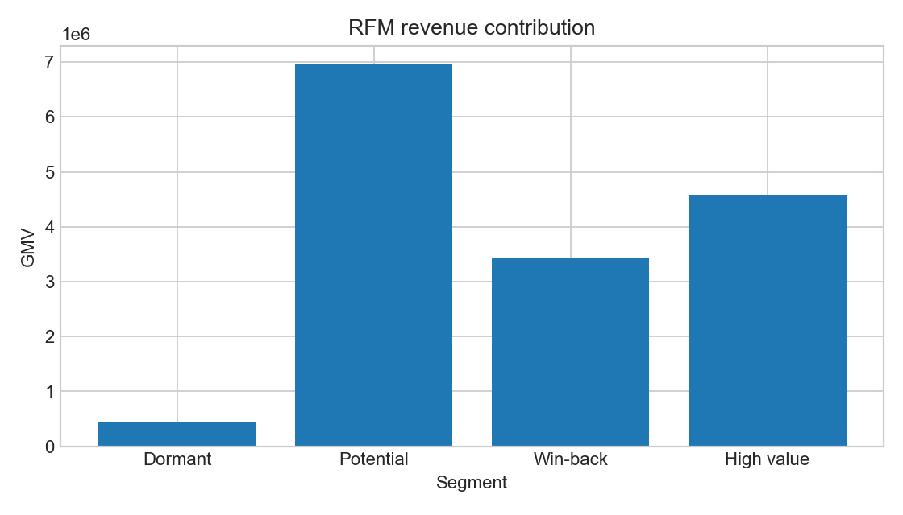

# 电商经营增长诊断与用户复购提升

> **数据状态：OLIST_ACTUAL。** 本报告基于 Olist 公开数据集重跑，数据截止下单日期为 2018-08-29。营销 A/B 一节是独立的统计方法模拟，不是 Olist 真实实验，绝不将其作为业务证据。

## 给业务负责人的执行摘要

在“已交付、金额为正”的商品成交口径下，Olist 有 96,478 笔订单、93,358 位用户、GMV 15,419,773.75，观察窗复购率仅 3.0%。2018-07 完整月 GMV 为 1,027,807.28，环比 2018-06 增长 1.6%；同期活跃用户增长 0.6%，每活跃用户订单数增长 0.3%，客单价增长 0.6%。增长存在但动能有限，且不能把乘法分解直接解释为因果贡献。

真正优先级是体验与复购基础：逾期订单的平均评分为 2.57，显著低于未逾期订单的 4.29（描述性关联，非因果）；高价值 RFM 用户 15,489 人、贡献 4,586,310.19 GMV（29.7%）。建议先减少逾期，再保护高价值人群，最后对需唤回人群以随机实验验证触达策略。

## 数据、口径与质量

- 来源：Kaggle Olist Brazilian E-Commerce Dataset；时间覆盖 2016-09 至 2018-08-29。
- GMV：已交付订单的商品金额 + 运费，不等同于支付实收；支付表只作支付方式分类。
- 用户主键：`customer_unique_id`；不能以订单级 `customer_id` 衡量复购。
- 质量门禁：99,441 笔订单、112,650 商品行、103,886 支付行均无重复主键；订单客户关联、已交付订单金额、交付时间和事实表唯一性检查均为 0 异常。详见 `dashboard/data/data_quality.csv`。
- 2018-08 不是完整自然月，趋势图和环比结论默认排除；输出字段 `is_complete_month` 已标记。

## 实际分析结果

| 维度 | 结果 | 业务含义 |
|---|---:|---|
| GMV / 订单 / 用户 | 15,419,773.75 / 96,478 / 93,358 | 仅已交付正金额订单 |
| 观察窗复购率 | 3.0% | 低复购是核心增长约束；受观察窗与新近首购影响 |
| 2018-07 完整月 GMV | 1,027,807.28 | 对 2018-06 环比 +1.6% |
| 高价值 RFM | 15,489 人；4,586,310.19 GMV | 贡献 29.7% GMV，适合优先保护 |
| 逾期交付 | 7,826 单；平均评分 2.57 | 未逾期 88,644 单、平均评分 4.29；仅为相关性 |
| 最大 GMV 品类 | beleza_saude；1,417,104.17 | 后续应结合毛利与供给约束决策 |

## 用户分层与留存

RFM 采用数据截止日 + 1 天计算 Recency，Frequency 为订单数，Monetary 为 GMV；分位打分是相对排序，不是用户价值的因果预测。高价值组平均频次仅 1.14，说明即使价值较高，也仍有明显的二单转化空间。Cohort 热力图应仅比较 `m3_mature=True` 的 cohort，并将 0 活跃月与缺失明确区分。

## 营销评估：模拟 A/B（仅统计方法演示）

该数据集没有真实曝光、分组或营销成本字段，因此不能评估真实营销增量。为演示方法，代码按用户随机分组并模拟转化：对照组 46,835 人、实验组 46,523 人，模拟差异 +1.91pp，95% CI [1.51pp, 2.31pp]，比例差 z 检验 p<0.001，近似 MDE 为 0.57pp。**这些数值由代码的人为机制生成，不能作为 Olist 营销效果或策略证据。**真实实验须预注册主指标、按用户随机、采集曝光/成本并以增量 GMV 或增量利润判定。

## 建议、优先级与 GMV 情景测算

| 优先级 | 策略 | 假设与公式 | 观察窗 GMV 情景值 | 验证方式与局限 |
|---|---|---|---:|---|
| P0 | 治理逾期履约 | 假设 7,826 笔逾期订单中 20% 因体验修复产生一次额外购买；=7,826×20%×未逾期 AOV 158.69 | 248,379 | 评分差不是因果；需按物流/品类分层并做履约试点 |
| P1 | 高价值用户关怀 | 假设 15,489 人中 8% 增加一单；=15,489×8%×高价值组订单均额 258.92 | 320,837 | 需扣除权益与服务成本，并用留出组测增量 |
| P2 | 需唤回人群小流量实验 | 假设 32,020 人中 5% 额外购买；=32,020×5%×全样本 AOV 159.82 | 255,883 | 假设未经验证；优惠可能造成自然购买前置或毛利侵蚀 |

这些是同一观察窗内、未扣成本的 GMV 情景，不是年化值、收入预测、利润或 ROI。三项不可直接相加：目标人群可能重叠，且必须以对照组识别增量。

## 风险与局限

Olist 缺少完整流量、曝光、营销成本、毛利、退款和渠道归因，因此不能直接计算漏斗转化、ROI 或因果效果；评价有缺失与选择偏差；2018-08 不完整；RFM 的分位阈值随数据窗变化。完整的口径说明与项目复盘见 `docs/` 目录。
